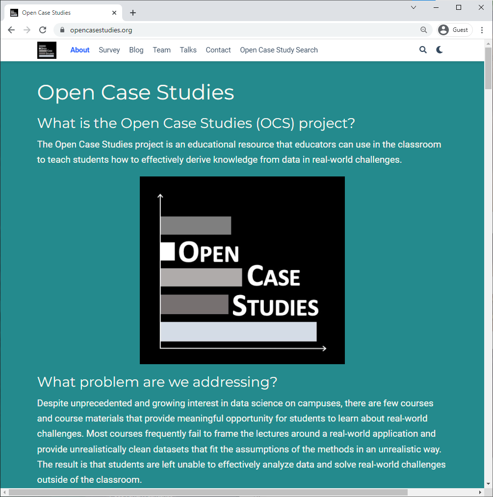
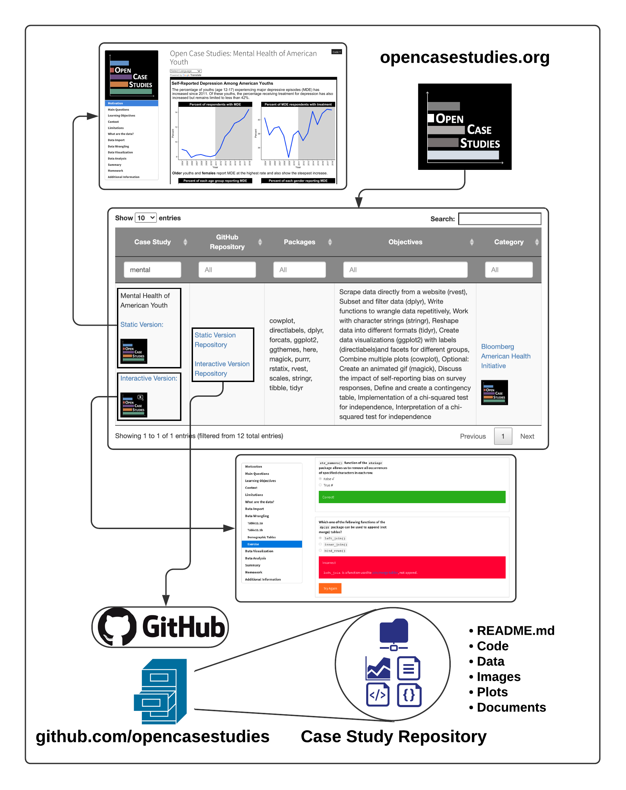
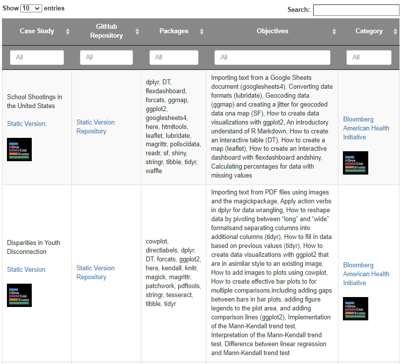
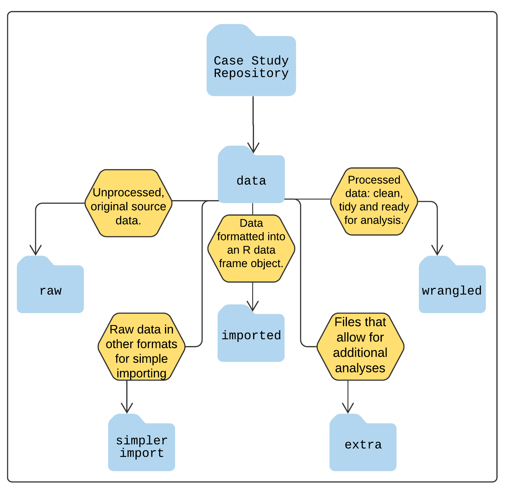

# Open Case Study Infrastructure

## Learning Objectives

In this chapter we will discuss the overall infrastructure of the Open Case Studies platform, which includes:

- the Open Case Studies (OCS) website
- methods to provide feedback
- a search tool to find case studies
- the OCS GitHub organization
- our R package called `OCSdata`


## OCS Website



The [OpenCaseStudies website](https://www.opencasestudies.org/) describes the mission of the Open Case Studies project, the history of its inception, current and previous members of the OCS team, an archive of talks and blog posts and other information. 

Links to all of our case studies can be found on the Open Case Studies website. The case studies are listed in a searchable table that will be detailed further in the following section.  

## Feedback

We are continually striving to make our case studies better. Please contact us if you have ideas for suggestions for the project or new ideas for how case studies can be used in the classroom.

Also please let us know if you notice typos or errors, or if you are interested in getting involved.

### Email Form

The website contains a contact [email form](https://www.opencasestudies.org/OCS_Guide/introduction.html#contact-us) that may be used to send a message to Open Case Studies to ask a question or provide suggestions.

### Survey

There is also a [survey](https://docs.google.com/forms/d/e/1FAIpQLSfpN4FN3KELqBNEgf2Atpi7Wy7Nqy2beSkFQINL7Y5sAMV5_w/viewform?usp=sf_link) available on our website and also within the case studies themselves that allows us to do research on case study use. 

The survey should take no more than 10 minutes to complete. Your feedback helps us learn more about how to improve the data science education experience. Part of this includes getting a better understanding of who is using our case studies and how so that we can better design our case studies. We would greatly appreciate you filling it out if you have the time!


## OCS Case Study Search Tool

The website also includes the case study search tool to aid instructors in finding appropriate case studies for their learning objectives. Accessing the search tool and how to use it is described in more detail below.

This diagram illustrates the workflow of accessing a case study from the OCS website through the case study search table. From the table, users can use the provided links to view the original static case studies, interactive case studies, and the GitHub repositories for each. Users may find all case study source files in the case study repository, as well as instructions on how to use the case study.



The [Open Case Study Search](https://www.opencasestudies.org/#searchtab) tool can be found at the bottom of the [OCS Website](https://www.opencasestudies.org/). The tool consists of a table with searchable columns and each row describing an individual case study. This searchable table is designed to aid instructors in identifying appropriate case studies for their learning objectives. The columns are organized as such:

- The "Case Study" column contains the case study name and a link to the static and interactive versions of the case study (if available)
- The "GitHub Repository" column provides links to the case study's associated GitHub repository that contains all case study source files, data, code, and more
- The "Packages" column details all the R packages used in the case study, and can help identify if a case study teaches a specific data import, wrangling, analysis, or visualization skill
- The "Objectives" column details the learning objectives of each case study (e.g. importing data from PDF files, reshaping data, specific statistical analysis, etc.)
- The "Category" column lists the source of funding or project that the case study is associated with

The main two columns likely to be helpful in identifying appropriate case studies are the "Packages" and "Objectives" columns. Users may search for keywords across all columns using the overall search bar, otherwise users can search individual columns of interest. 

This table can be used to access all case study resources:



## Open Case Studies GitHub Organization

GitHub is a website and cloud service that enables developers to store, manage, and track changes to their code. OCS uses GitHub for both development and distribution purposes. Users have complete access to all case study material through our [OCS GitHub page](https://github.com/opencasestudies) where each case study is hosted in an individual repository. The repository contains all the materials needed for the case study. This includes the case study text to be distributed to students, the data used in the case study (discussed below), additional documents and references, and brief guidelines on case study use.

Data included in the GitHub repository is available in multiple formats to enable modular use of the case studies. This diagram explains the case study data folder structure and how data is categorized into different sub-folders:



Data included in the GitHub repository is available in multiple formats to facilitate modularization of the case studies as described below. To use the case study data, you can download the GitHub repository directly or use the `OCSdata` R package described below. 

## OCSdata 

To simplify the process of accessing the data required for each case study, we have created the `OCSdata` R package. Briefly, the `OCSdata` package creates a new folder called "OCSdata" where it downloads the data needed for a specific case study. Users can download the data in its original raw format or in various processed formats that correspond to different stages of data wrangling and cleaning. This allows users to perform the data exploration and wrangling or the data visualization and analysis sections of the case study without having to process the data from the raw files. For some of the case studies, the `OCSdata` package also downloads extra source data that is not used in the case study. 

The following are the main functions to import data in various formats using the `OCSdata` package. Each function is described in more detail in the `OCSdata` [package documentation](https://cran.r-project.org/web/packages/OCSdata/index.html).

| Data Folder | Case Study Section | `OCSdata` Function |
| ----- | -------- | ------ |
| raw | Data Import | `raw_data` |
| imported | Data Exploration, Data Wrangling | `imported_data` |
| wrangled | Data Visualization, Data Analysis | `wrangled_csv`, `wrangled_rda` |
| simpler_import | Data Import | `simpler_import_data` |
| extra | Suggested Homework (?) | `extra_data` |


### Getting Started with `OCSdata`

The `OCSdata` package is available on the package repository [CRAN](https://cran.r-project.org/web/packages/OCSdata/index.html). It requires R 3.5 or higher and can be installed in R as follows: 


```r
install.packages("OCSdata") #only run once to install package
library(OCSdata) #run every new R session to load package
```

### Downloading raw data

The `raw_data` function will download the raw data files that can be imported into R. 

The first argument is the name of the case study. A list of case study names can be found in the package documentation [online](https://cran.r-project.org/web/packages/OCSdata/vignettes/instructions.html#casestudy) or by typing `?raw_data` in R. 

The `outpath` argument is a string specifying the folder where the data should be downloaded. To download the data to a folder named "OCS_data" in the current working directory, you can supply `getwd()` to the `output` argument. If nothing is provided for the argument, you will be prompted to enter 1, 2, or 3 to download the data into the current director, to specify the download path, or to cancel, respectively. 

In the following example, we download the raw data for the "Opioids in the United States" case study to the current directory. 


```r
raw_data("ocs-bp-opioid-rural-urban", outpath = getwd())
```

### Downloading data in other formats

The `OCSdata` package can be used to download the data in various processed formats that may be helpful in skipping certain case study sections and focusing on data wrangling and/or analysis and visualization. All of the functions take the same arguments described above.

#### Simpler import

The `simpler_import_data()` function will download raw data files that have been converted to file formats that are easier to import into R, typically .csv. Some case studies offer this option when the original raw files require a more complicated import step. 


```r
simpler_import_data("ocs-bp-opioid-rural-urban", outpath = getwd())
```

#### Importing data as R objects 

The `imported_data()` function will download raw data files in .rda format. This means the data have already been imported into R objects. This can be used to skip the data import section and start directly with data wrangling. The R objects files can be imported into R by either double clicking on the files in RStudio or using the `load()` function as follows. 


```r
imported_data("ocs-bp-opioid-rural-urban", outpath = getwd()) #download data in .rda format 
file_path = "~/OCS_data/data/imported/land_area.rda" #specify download directory 
load(file_path) #load R objects 
```

#### Importing wrangled data

The following functions will download the data files that have already been wrangled and are ready to be analyzed. These come in both .csv and .rda formats.

Download as csv files:


```r
wrangled_csv("ocs-bp-opioid-rural-urban", outpath = getwd()) 
```

Downloading as R objects:


```r
wrangled_rda("ocs-bp-opioid-rural-urban", outpath = getwd()) 
```

### Downloading extra data

Some case studies have extra data are not used in the case study but can be used to explore the case study subject from different perspectives. These data  but can This data can be downloaded using the `extra_data()` function. 


```r
extra_data("ocs-bp-opioid-rural-urban", outpath = getwd()) 
```

### Downloading all case study data

The `zip_ocs()` function will download the all of the repository files in a .zip folder and unzip them into a specified directory. This includes the case study data in all the formats detailed above (raw, simpler_import, imported, wrangled, and extra). It also includes the case study .Rmd file, which can be modified by instructors as needed. We recommend using this method over cloning or forking (terms that you may be familiar with if you are familiar with Git and GitHub), as this will not result in the user getting all of our git history. 

If you choose to fork the repository you will automatically generate a repository on GitHub and your repository will have connections to the original case study. This can be helpful for pulling any changes to the original case study. It can also be helpful if you want to send edits to the original case study in the form of what is called a pull request.  

If you clone the case study repository, you can set it up on GitHub as well with a few more steps and you will not preserve any connection to the original case study repository.

Again, don't worry if all these terms are new to you. You can just use the `zip_ocs()` function instead. Otherwise take a look at @happywithgitr to learn more.


```r
zip_ocs("ocs-bp-opioid-rural-urban", outpath = getwd()) 
```

### Fork or clone the case study repository

If instead users are familiar with Git and GitHub and want to fork or clone the case study repository, this can also easily be done using the `OCSdata` package. The `clone_ocs()` function of the `OCSdata` package can be used to do either. If the `fork_repo` function is set to `TRUE` it will fork the repo, otherwise, by default, it will clone the repository. These functions will result in the same outcome as using GitHub to clone or fork the repo.

Again you can also specify the outpath location as in the previous description about the `zip_ocs()` function.


```r
# clone a repository
OCSdata::clone_ocs(casestudy = "ocs-bp-diet")

#fork a repository
OCSdata::clone_ocs(casestudy = "ocs-bp-diet", fork_repo = "TRUE")
```

However, using these functions will involve the users getting all of our git history so we suggest that users use the `zip_ocs()` function (described in the above section) of `OCSdata` instead. 


## Session info


```
## R version 4.0.2 (2020-06-22)
## Platform: x86_64-pc-linux-gnu (64-bit)
## Running under: Ubuntu 20.04.3 LTS
## 
## Matrix products: default
## BLAS/LAPACK: /usr/lib/x86_64-linux-gnu/openblas-pthread/libopenblasp-r0.3.8.so
## 
## locale:
##  [1] LC_CTYPE=en_US.UTF-8       LC_NUMERIC=C              
##  [3] LC_TIME=en_US.UTF-8        LC_COLLATE=en_US.UTF-8    
##  [5] LC_MONETARY=en_US.UTF-8    LC_MESSAGES=C             
##  [7] LC_PAPER=en_US.UTF-8       LC_NAME=C                 
##  [9] LC_ADDRESS=C               LC_TELEPHONE=C            
## [11] LC_MEASUREMENT=en_US.UTF-8 LC_IDENTIFICATION=C       
## 
## attached base packages:
## [1] stats     graphics  grDevices utils     datasets  methods   base     
## 
## loaded via a namespace (and not attached):
##  [1] bookdown_0.24   crayon_1.3.4    digest_0.6.25   R6_2.4.1       
##  [5] lifecycle_1.0.0 magrittr_2.0.2  evaluate_0.14   pillar_1.4.6   
##  [9] rlang_0.4.10    stringi_1.5.3   fs_1.5.0        ellipsis_0.3.1 
## [13] vctrs_0.3.4     rmarkdown_2.10  tools_4.0.2     stringr_1.4.0  
## [17] readr_1.4.0     hms_0.5.3       xfun_0.26       yaml_2.2.1     
## [21] compiler_4.0.2  pkgconfig_2.0.3 htmltools_0.5.0 ottrpal_0.1.2  
## [25] knitr_1.33      tibble_3.0.3
```
